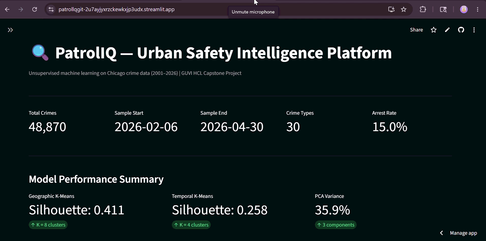
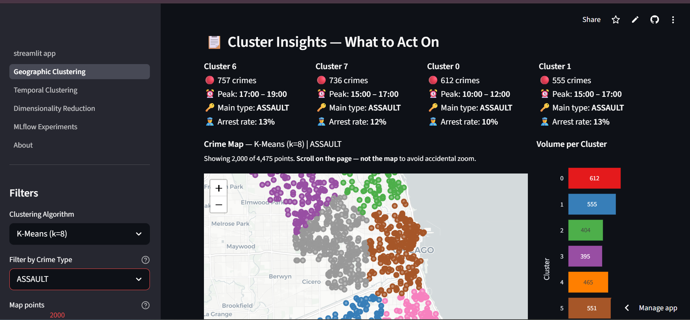
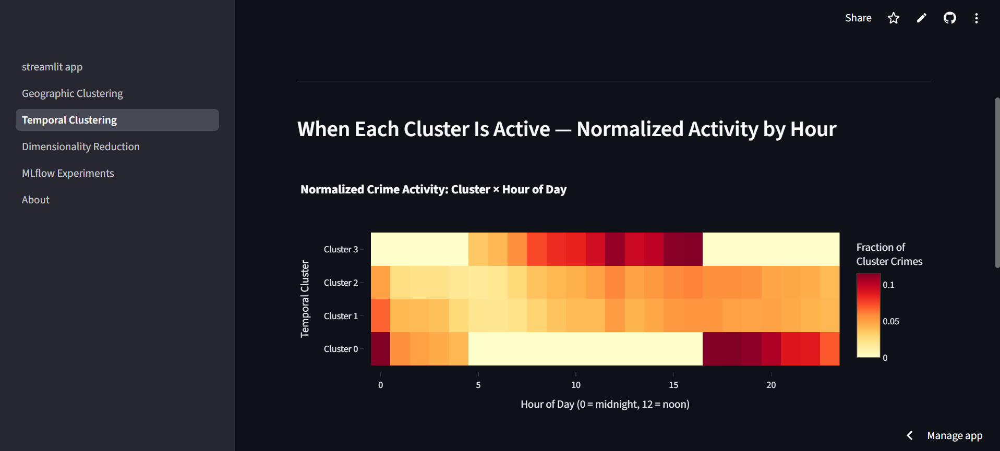

# PatrolIQ — Urban Safety Intelligence Platform

> **8.5M Chicago crime records · 6 unsupervised ML models · Full MLOps stack**


A production-grade crime intelligence platform built on a decade of Chicago public safety data. Covers the complete ML lifecycle: raw data ingestion → feature engineering → unsupervised clustering → real-time inference → monitoring → interactive dashboard.

**Engineering highlights:** sub-millisecond cluster inference · API key–protected admin endpoints · KS-test + chi-squared drift detection · lru_cache model loading with hot-reload · Prometheus metrics + Grafana dashboards · 64 automated tests · GitHub Actions CI

---

## Demo



---

## Screenshots

| Geographic Clustering — Crime Hotspot Map | Temporal Clustering — Activity Heatmap |
|---|---|
|  |  |

> **Geographic:** 4,475 ASSAULT incidents across 8 K-Means clusters. Each cluster shows peak hour, dominant crime type, and arrest rate — actionable insights for patrol planning.
>
> **Temporal:** Normalised crime activity by cluster × hour. Cluster 0 peaks overnight (0–5 AM), Cluster 3 peaks early evening (15–20). Used to plan shift allocation.

---

## Documentation

| Document | Description |
|----------|-------------|
| [Model Card](MODEL_CARD.md) | Algorithms, metrics, ethical considerations, and out-of-scope uses for all 6 models |
| [Runbook](RUNBOOK.md) | Incident response procedures for all 4 Docker services |

---

## What This Project Does

| Layer | What's Built |
|-------|-------------|
| **Data Pipeline** | Cleans 8.5M raw Chicago crime records → 500K sampled dataset with Beat-median imputation for missing coordinates |
| **Feature Engineering** | Cyclical sin/cos encoding for hour/month/day-of-week; severity scores; district-level aggregates |
| **Geographic Clustering** | K-Means (k=8), DBSCAN, and Hierarchical (Ward) on lat/lon features — maps to 8 CPD patrol districts |
| **Temporal Clustering** | K-Means (k=4) on cyclical temporal features — identifies 4 daily activity windows for shift planning |
| **Dimensionality Reduction** | PCA (3 components) + t-SNE for cluster visualisation and structure validation |
| **Experiment Tracking** | MLflow with 16 logged runs, model registry, and JSON export summaries |
| **Inference API** | FastAPI serving geographic and temporal cluster predictions with Prometheus metrics |
| **Drift Detection** | KS-test + chi-squared on 4 monitored features; per-feature drift counters in Prometheus |
| **Dashboard** | Streamlit app with **5 pages and 20+ interactive charts** — loads pre-computed artifacts, no cloud training |
| **Monitoring** | Prometheus scraping + 4 Grafana dashboards (latency, request counts, drift events, model version) |
| **Tests** | 64 automated tests across API, clustering, drift, preprocessing, and pipeline layers |

---

## Architecture

```
Raw CSV (8.5M rows, Chicago Data Portal)
         │
         ▼
  Data Pipeline ─────────────────────────► Processed Data
  (cleaning, sampling, imputation)          (500K rows, .csv.gz)
                                                     │
                                          ┌──────────┴──────────┐
                                          ▼                     ▼
                                  Feature Engineering      EDA Artifacts
                                  (cyclical encoding,
                                   severity scores)
                                          │
                              ┌───────────┴──────────────┐
                              ▼                           ▼
                       ML Training                  MLflow Tracking
                  ┌────────┬────────┐              (16 runs logged)
                  ▼        ▼        ▼
              Geographic  Temporal  Dimensionality
              Clustering  Clustering  Reduction
             (K-Means·   (K-Means·  (PCA + t-SNE)
              DBSCAN·     k=4)
              Hierarchical)
                  └────────┴────────┘
                           │
              ┌────────────┴─────────────────┐
              ▼                              ▼
     FastAPI Inference API          Streamlit Dashboard
     (geographic + temporal          (5 pages, Folium map,
      cluster prediction,            hourly heatmap,
      /v1/health, /metrics)          MLflow comparison)
              │
              ▼
     Prometheus + Grafana
     (latency · request counts
      drift counters · model version)
```

---

## Dashboard Pages

| Page | Coverage | Key Visuals |
|------|----------|-------------|
| **1 — Geographic Clustering** | Spatial crime hotspots, cluster profiles, arrest rates | Folium choropleth map, cluster insight cards, dominant crime type per cluster |
| **2 — Temporal Clustering** | Daily activity windows, weekend vs weekday patterns | Hourly activity heatmap, cluster descriptions (overnight / morning / evening), temporal profile chart |
| **3 — Dimensionality Reduction** | Feature structure, cluster separability validation | PCA scree plot (cumulative variance), t-SNE scatter coloured by cluster |
| **4 — MLflow Experiments** | Run comparison, hyperparameter sweep, model registry | Run metrics table, silhouette vs k chart, registered model view |
| **5 — About** | Project metrics, architecture summary, ethical considerations | Key results table, compliance notes, data source reference |

---

## ML Models

### 1. Geographic K-Means (k=8) — Primary Model
- **Algorithm:** K-Means with k=8 (domain-driven: matches 8 CPD patrol districts)
- **Features:** Latitude, longitude + engineered district/beat aggregates
- **Metrics:** Silhouette Score **0.41** · Davies-Bouldin **0.78**
- **Inference:** Nearest-centroid lookup on pre-trained labels — sub-millisecond via `lru_cache`

### 2. Geographic DBSCAN
- **Algorithm:** DBSCAN (eps=0.008°, min_samples=100)
- **Purpose:** Detect natural density clusters without forcing k; validate noise fraction
- **Metric:** Noise fraction **3.83%** (< 10% target ✓) — silhouette not applicable for density-based shapes

### 3. Geographic Hierarchical (Ward)
- **Algorithm:** Agglomerative clustering with Ward linkage (k=8, 10K subsample)
- **Metrics:** Silhouette Score **0.34** · Davies-Bouldin **0.88**
- **Purpose:** Alternative spatial grouping — compared against K-Means via MLflow

### 4. Temporal K-Means (k=4)
- **Algorithm:** K-Means with k=4 (maps to 4 natural activity windows: overnight / morning / afternoon / evening)
- **Features:** Cyclical sin/cos encoding of hour, day-of-week, and month
- **Metrics:** Silhouette Score **0.26** · Davies-Bouldin **1.45**
- **Serialization:** Saved as `.pkl` via joblib; loaded once at API startup via `lru_cache`

### 5. PCA (3 components)
- **Purpose:** Dimensionality reduction for cluster visualisation and variance analysis
- **Output:** Cumulative variance **35.9%** with 3 components (cyclical feature correlation limits linear decomposition)
- **Note:** t-SNE visual separation compensates for low PCA variance in 3-month FAST_MODE window

### 6. t-SNE
- **Algorithm:** t-SNE (perplexity=30, n_iter=1000, 5K subsample for speed)
- **Purpose:** Non-linear 2D embedding to validate cluster structure and separability
- **Metric:** KL divergence **1.31**

---

## Tech Stack

```
Python 3.11          scikit-learn 1.5.2    pandas 2.1.4
numpy 1.26.4         MLflow 2.14.1         FastAPI 0.115
Streamlit 1.37.0     Plotly 5.22.0         Folium 0.17.0
Prometheus client    Grafana 10.4.3        pytest
Docker Compose       GitHub Actions        joblib
```

---

## Project Structure

```
PatrollQ/
├── streamlit_app.py                  # Home dashboard (KPIs + architecture overview)
├── pages/
│   ├── 1_Geographic_Clustering.py    # Folium map + cluster insight cards
│   ├── 2_Temporal_Clustering.py      # Hourly heatmap + weekend analysis
│   ├── 3_Dimensionality_Reduction.py # PCA scree + t-SNE scatter
│   ├── 4_MLflow_Experiments.py       # Run comparison + model registry
│   └── 5_About.py                    # Metrics, architecture, compliance
├── src/
│   ├── data/                         # loader.py, preprocessor.py
│   ├── features/                     # engineer.py (cyclical encoding, severity scores)
│   ├── models/                       # geographic/, temporal/, dimensionality_reduction/
│   ├── monitoring/                   # drift.py (KS-test + chi-squared)
│   └── utils/                        # helpers.py (NumpyEncoder, MLflow export), logger.py
├── api/
│   ├── main.py                       # FastAPI app — 6 endpoints + Prometheus middleware
│   ├── predictor.py                  # lru_cache model loading + predict functions
│   └── schemas.py                    # Pydantic request/response schemas
├── notebooks/                        # 8 sequential pipeline scripts (.py format)
├── artifacts/                        # Pre-computed labels, metrics, MLflow JSON exports
├── monitoring/
│   ├── prometheus.yml                # Scrape config (api:8000/metrics, 15s interval)
│   └── grafana/                      # Provisioned dashboards + datasource config
├── scripts/
│   ├── run_full_pipeline.py          # End-to-end training pipeline
│   └── reproduce_results.py          # Reproducibility check (seed=42)
├── tests/                            # 64 tests across 7 files
├── config.py                         # All hyperparameters and paths
├── docker-compose.yml                # 4-service stack (Streamlit·API·Prometheus·Grafana)
├── Dockerfile                        # Streamlit image
├── api/Dockerfile                    # FastAPI image
├── MODEL_CARD.md                     # Model descriptions, metrics, ethical considerations
├── RUNBOOK.md                        # Incident response for all 4 services
└── .github/workflows/ci.yml          # Lint → 64 tests → docker build
```

---

## Quick Start

### Verify the code — no data files needed

```bash
git clone https://github.com/PriyaMonisha/PatrollQ.git
cd PatrollQ
python -m venv venv
venv\Scripts\activate          # Windows
pip install -r requirements-dev.txt
pytest tests/ -v               # 64 tests pass — uses fixtures, no raw data required
```

Tests cover clustering logic, API endpoints, drift detection, feature engineering, and pipeline integration using in-memory fixtures. Raw CSVs are not committed (size); the test suite verifies correctness without them.

---

### Option A — Streamlit dashboard only (2 minutes, no Docker)

Artifacts are pre-computed and committed — no training needed.

```bash
pip install -r requirements.txt
streamlit run streamlit_app.py
```

Dashboard opens at **http://localhost:8501**

---

### Option B — Full MLOps stack via Docker (requires Docker Desktop)

```bash
# Copy and edit env file
copy .env.example .env
# Set PATROLIQ_API_KEY=any-secret-string in .env

docker compose up -d
```

| Service | URL | Purpose |
|---------|-----|---------|
| Streamlit | http://localhost:8501 | Interactive dashboard |
| FastAPI | http://localhost:8000 | Cluster inference API |
| Prometheus | http://localhost:9090 | Metrics collector |
| Grafana | http://localhost:3000 | Live dashboards (admin/admin) |

```bash
docker compose logs -f api      # stream API logs
docker compose ps               # check health status
docker compose down             # stop all services
docker compose build --no-cache # rebuild after code changes
```

---

### Reproduce Training Results

```bash
# Re-run the full training pipeline from scratch
python scripts/run_full_pipeline.py

# Verify results match reference values (seed=42)
python scripts/reproduce_results.py --seed 42
```

---

## API Endpoints

All prediction and monitoring endpoints are open by default. The `/v1/admin/*` endpoint requires the `X-API-Key` header matching `PATROLIQ_API_KEY`.

```bash
# Geographic cluster prediction
curl -X POST http://localhost:8000/v1/predict/geographic \
  -H "Content-Type: application/json" \
  -d '{"lat": 41.85, "lon": -87.65}'

# Admin — force model reload after retraining (no container restart)
curl -X POST http://localhost:8000/v1/admin/reload-models \
  -H "X-API-Key: your-secret-key"
```

| Method | Endpoint | Auth | Description |
|--------|----------|------|-------------|
| GET | `/v1/health` | None | Service health + model load status |
| GET | `/metrics` | None | Prometheus metrics (scraped every 15s) |
| POST | `/v1/predict/geographic` | None | Geographic cluster ID for a lat/lon coordinate |
| POST | `/v1/predict/temporal` | None | Temporal cluster ID for hour/day/month/is_weekend |
| GET | `/v1/drift/report` | None | KS-test + chi-squared drift report for 4 features |
| POST | `/v1/admin/reload-models` | Required | Force lru_cache clear — hot-reload models from disk |

API docs available at **http://localhost:8000/docs**

---

## Tests

```bash
pytest tests/ -v                          # 64 tests
pytest tests/ --cov=src --cov=api         # with coverage report
```

| File | Tests | Coverage |
|------|-------|----------|
| `test_api.py` | 18 | All 6 endpoints + auth + error cases |
| `test_helpers.py` | 12 | NumpyEncoder, MLflow export utilities |
| `test_drift.py` | 8 | KS-test, chi-squared, feature drift signals |
| `test_clustering.py` | 7 | K-Means, DBSCAN, silhouette scoring |
| `test_feature_engineer.py` | 7 | Cyclical encoding, severity scores |
| `test_preprocessor.py` | 7 | Cleaning, imputation, out-of-bounds removal |
| `test_pipeline_integration.py` | 5 | End-to-end data → labels → artifacts |

CI runs on every push via GitHub Actions (`.github/workflows/ci.yml`).

---

## Production Readiness

| Category | What's Implemented |
|---|---|
| **Security** | API key auth on admin endpoints · no secrets in VCS · CORS restricted to Streamlit origin |
| **Performance** | Models preloaded via `lru_cache` — zero disk I/O per prediction request · vectorised feature engineering |
| **Reliability** | Health checks on all 4 Docker services · 64 automated tests · CI on every push |
| **MLOps** | MLflow experiment tracking (16 runs) · model registry · hot-reload without container restart |
| **Observability** | Prometheus counters (requests, drift events) · Histogram (latency buckets) · Gauge (model version) · 4 Grafana dashboards |
| **Reproducibility** | Fixed `random_state=42` across all models · `reproduce_results.py` verifies seed consistency |

---

## Key Design Decisions

- **k=8 is domain-driven, not elbow-optimal:** Elbow method suggests k=2 (North/South split), which is statistically optimal but operationally useless. k=8 matches actual CPD patrol district boundaries.
- **Cyclical encoding:** Hour, day-of-week, and month are encoded as sin/cos pairs so the model understands that hour 23 and hour 0 are adjacent, not distant.
- **DBSCAN noise fraction as primary metric:** Silhouette score assumes convex clusters and is inappropriate for DBSCAN. Noise fraction (3.83% < 10%) is the operationally meaningful signal.
- **lru_cache for model loading:** Models are loaded once on first prediction request and cached in memory. The `/v1/admin/reload-models` endpoint clears the cache for hot-reloads after retraining.
- **Artifacts committed to repo:** Pre-computed labels/metrics let the Streamlit dashboard run on Streamlit Cloud without triggering training (which would exceed memory limits and require the raw CSV).
- **KS-test + chi-squared for drift:** Kolmogorov-Smirnov tests continuous features (lat, lon, hour); chi-squared tests categorical features (crime_type, district). Both are persisted to Prometheus for alerting.
- **Temporal features over raw timestamps:** Raw datetime was decomposed into cyclical hour/day/month components so the model captures periodicity, not magnitude.

---

## Common Issues

| Problem | Fix |
|---------|-----|
| `FileNotFoundError: chicago_crime_500k.csv.gz` | Run `python scripts/run_full_pipeline.py` first |
| Port 5000 conflict (MLflow UI) | `mlflow ui --port 5001` |
| `ModuleNotFoundError: config` | Activate venv: `venv\Scripts\activate` |
| API returns 503 on predict | Artifacts missing — run pipeline or check `artifacts/geographic/` exists |
| Grafana shows no data | Prometheus must be scraping: verify `docker compose ps` shows `api` as healthy |

---

## Data

| Dataset | Records | Period |
|---------|---------|--------|
| Chicago crime incidents (full) | 8,500,000 | 2001–2026 |
| Sampled for training | 500,000 | Most-recent records |
| FAST_MODE sample | 48,870 | Feb–Apr 2026 |

Source: [Chicago Data Portal — Crimes 2001 to Present](https://data.cityofchicago.org/Public-Safety/Crimes-2001-to-Present/ijzp-q8t2) — updated daily.

---

## Ethical Considerations

Crime data reflects **historical policing patterns, not actual crime rates.** Areas with historically higher police presence generate more recorded incidents — creating a self-reinforcing feedback loop where the model may over-recommend patrol in communities that have been historically over-policed.

**This model must never be used as the sole basis for enforcement decisions.** See [MODEL_CARD.md](MODEL_CARD.md) for full ethical analysis, recommended mitigations, and explicit out-of-scope uses.

---

## Author

**Priya Monisha** · [GitHub](https://github.com/PriyaMonisha)
